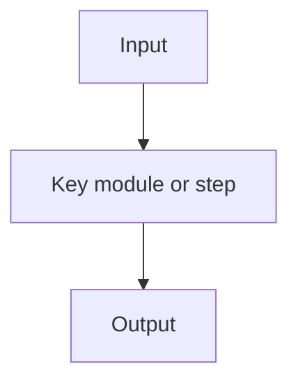

# {blog_title}

## 快速导读

- 这篇论文研究什么问题？
- 核心想法是什么？
- 最重要的结果是什么？
- 哪些读者值得优先阅读？
- 如果 `value_tags` 非空，这些具体实体为什么构成文章价值信号？

## {自适应章节：问题背景}

解释任务、场景、已有方法的不足，以及这个问题为什么重要。

## {自适应章节：核心思路与贡献图谱}

必要时使用贡献/主张表格。

| 主张或贡献 | 论文中的证据 | 需要注意的边界 |
|---|---|---|
| ... | ... | ... |

## {自适应章节：技术机制还原}

按最适合读者理解的顺序解释方法、系统、benchmark、理论或数据集。

## {自适应章节：具体例子}

当机制较抽象或多步骤时，用一个具体例子贯穿解释。

## {自适应章节：证据与结果解读}

解释实验、指标、baseline、消融、案例分析或证明到底支持了什么结论。

## {自适应章节：批判性边界分析}

讨论局限、失败案例、可疑假设、隐藏成本和证据缺口。

## {自适应章节：扩展方向与结论}

说明这篇论文真正改变了什么，谁可以复用这个思路，以及哪些后续工作值得尝试。
